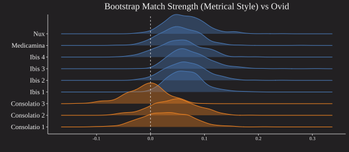

# nux-paper  

# Anxiety, Authorship and Walnuts: A Stylometric Reassessment of the (Pseudo?) Ovidian _Nux_

Technical reproduction materials for our presentation at 'Influence 50 Years On' https://influenceoxford.wordpress.com/, Magdalen College Oxford, September 25, 2023.

The code in this notebook should precisely replicate every figure and result from the conference paper and presentation.

## ABSTRACT

The _Nux_ (or _De nuce_, ‘On the Walnut Tree’), has been described as ‘the most accomplished of pseudo-Ovidian poems’ (Tarrant in Reynolds 1983: 286). Its disputed authorship provokes anxiety. It is too good, scholars feel and felt, to be anonymous or pseudepigraphal, and it was considered a canonically and genuinely Ovidian poem until the 18th century, with no less a scholar than Erasmus favouring it with a full commentary. Today, it is generally considered a pseudo-Ovid, despite these desires and anxieties. Recent scholarship suggests that the debate is closed—the _Nux_ is included in the 2020 edition of medieval pseudo-Ovidiana, for instance—but this is based more on the lack of conclusive authentication than on positive evidence.

Using stylometric analysis, this paper reassesses the authorship and dating of the _Nux_. Stylometric analysis strongly suggests Ovidian authorship (from Ovid’s exilic period), or an imitator with an astoundingly innate sense for Ovidian composition. Or, perhaps, a mixture of the two, given the condition of the earliest surviving witnesses (from c. 1100), which contain medieval interpolations as well as potentially ancient poetry. ‘Genuine’, in the case of the _Nux_, cannot be considered a binary condition, and the poem therefore has much to tell us about how to approach literature of contested authenticity.

## TLDR

The _Nux_ is highly Ovidian, particuarly in its poetic (metrical, etc) style. Moreover, it is consistent with late Ovidian metrics more so than early, which is consistent with its presumed exilic composition. The _Medicamina_, another poem that has been questioned, is correctly identified as more consistent with earlier style. For comparison, we included the _Consolatio ad Liviam_ in our analysis, which is now accepted to be (Late Antique?) imitatio, but was accepted during the medieval period. The methods are able to distinguish between good imitatio and Ovid. This does not rule out the (faint) possibility that the _Nux_ is simply better imitatio, but such proofs are unobtainable.

### Cluster Analysis (poetic features)

### Bootstrap Distance Imposters (poetic features)

## Citation

TBD (a full paper is under preparation)

Authors: Rebecca Menmuir (QCL), Ben Nagy (IJP PAN)

## Technical

To run the repro code locally, you will need to pip install the packages from:

https://github.com/bnagy/ruzicka

https://github.com/bnagy/mqdq-parser

(they should install their own deps)

## LICENSE

CC-BY 4.0 (see LICENSE.txt)
